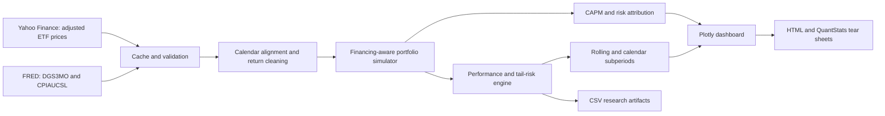

# Multi-Asset Performance and Risk Terminal

[](https://www.python.org/)
[](LICENSE)

A production-style Python research terminal that evaluates equities, bonds, commodities, real
estate, and cash on one standardized performance and risk framework. It downloads adjusted ETF
prices and FRED macro series, builds a financing-aware portfolio, separates beta from alpha,
measures return concentration, renders an interactive Plotly dashboard, and exports an automated
HTML tear sheet.

> **Research use only.** Historical results do not guarantee future performance. This repository
> is educational, not investment advice. Yahoo data obtained through `yfinance` are intended for
> research/personal use; review the data provider's terms before using this project commercially.

## Quick start

### Google Colab

Open [`notebooks/Multi_Asset_Performance_Risk_Terminal.ipynb`](notebooks/Multi_Asset_Performance_Risk_Terminal.ipynb),
set `REPO_URL` in the setup cell to your GitHub fork, and run all cells. A FRED key is recommended
but not required by this implementation's official CSV fallback.

### Local Python

```bash
python -m venv .venv
# Windows: .venv\Scripts\activate
# macOS/Linux: source .venv/bin/activate
python -m pip install -e ".[notebook,dev]"
python -m multi_asset_terminal --config config/default_config.json
pytest
```

The main report is written to `outputs/multi_asset_tear_sheet.html`. Cached source data live in
`data/cache/` and are excluded from version control.

## 1. Project overview

The default universe uses liquid ETF proxies with SPY as the policy benchmark:

| Asset class | Label | ETF | Default weight | Analytical role |
|---|---|---:|---:|---|
| US equities | US Equity | VTI | 30% | Domestic growth and equity beta |
| International equities | International Equity | VXUS | 15% | Geographic diversification |
| Investment-grade bonds | US Bonds | BND | 25% | Duration, defense, and income |
| Commodity/real asset | Gold | GLD | 10% | Crisis and inflation-sensitive exposure |
| Listed real estate | Real Estate | VNQ | 10% | Property and rate-sensitive equity exposure |
| Cash proxy | Cash ETF | BIL | 10% | Treasury-bill-like investable sleeve |

The separate FRED three-month Treasury yield is used in Sharpe, Sortino, alpha, and financing
calculations. BIL remains an investable asset; the FRED series is the analytical risk-free rate.
Every ticker, weight, date, benchmark, rebalance frequency, and risk assumption is configurable.

## 2. Real-world finance use case

A portfolio manager receives a strong trailing return and needs to answer four different questions:

1. Was the return genuine risk-adjusted skill, or primarily benchmark beta?
2. Did gross exposure and borrowing manufacture the result?
3. Which positions created total return, and which positions consumed the risk budget?
4. Would the track record still look attractive without a handful of exceptional days?

This terminal puts those answers in one repeatable tear sheet. Asset managers can use it for monthly
investment committee packs, private banks for client reviews, and hedge funds for rolling risk
monitoring. Unlike a simple return chart, the report makes leverage, financing, factor exposure,
tail loss, drawdown, and return concentration visible.

## 3. System architecture



The source package is deliberately modular. Data I/O has no metric logic; performance functions
accept already-cleaned return series; the portfolio simulator exposes daily weights and contribution
reconciliation; charts consume analysis results without recomputing statistics.

## 4. Required APIs and data sources

### Yahoo Finance via `yfinance`

- Daily adjusted ETF prices, downloaded with `auto_adjust=True`.
- `end` is handled as exclusive by `yfinance`; the pipeline adds one day to make the project
  configuration intuitive and inclusive.
- The downloader supports both current MultiIndex output and single-ticker flat columns.
- Responses are cached locally by a hash of ticker/date parameters.
- `yfinance` is an open-source client rather than an exchange-grade market-data feed. Replace this
  adapter with Bloomberg, Refinitiv, Polygon, or another licensed vendor before production trading.

### Federal Reserve Economic Data (FRED)

- `DGS3MO`: 3-month Treasury constant-maturity yield in annual percentage points.
- `CPIAUCSL`: seasonally adjusted US CPI index, transformed into trailing 12-month inflation.
- If `FRED_API_KEY` is set, the official series-observations JSON API is used.
- Without a key, the pipeline uses FRED's official graph CSV download endpoint.
- If both paths fail, the configured fallback annual rate is clearly warned and CPI output is marked
  unavailable; the pipeline never silently substitutes an invented macro series.

Store credentials in an environment variable—never commit them:

```python
import os
os.environ["FRED_API_KEY"] = "your_32_character_key"
```

Relevant documentation: [yfinance download](https://ranaroussi.github.io/yfinance/reference/api/yfinance.download.html),
[FRED observations API](https://fred.stlouisfed.org/docs/api/fred/series_observations.html), and
[FRED API terms](https://fred.stlouisfed.org/docs/api/terms_of_use.html).

## 5. Required Python libraries

| Library | Use |
|---|---|
| `pandas` | Calendar alignment, return panels, resampling, rolling analysis |
| `numpy` | Compounding, vectorized annualization, portfolio math |
| `yfinance` | Adjusted ETF price collection |
| `requests` | Retried FRED API/CSV requests with timeouts |
| `scipy` | Bias-corrected skewness and excess kurtosis |
| `statsmodels` | CAPM OLS with HAC-robust standard errors |
| `plotly` | Interactive, responsive professional charts |
| `quantstats` | Optional secondary benchmark tear sheet |
| `pytest` | Formula, invariant, and rendering tests |

Version ranges are declared in [`pyproject.toml`](pyproject.toml) and [`requirements.txt`](requirements.txt).

## 6. Folder/file structure

```text
multi-asset-risk-terminal/
├── config/
│   └── default_config.json
├── data/
│   └── cache/                    # Generated source-data cache; gitignored
├── notebooks/
│   └── Multi_Asset_Performance_Risk_Terminal.ipynb
├── outputs/                      # Generated CSV and HTML artifacts; gitignored
├── scripts/
│   └── build_notebook.py
├── src/multi_asset_terminal/
│   ├── __init__.py
│   ├── __main__.py
│   ├── attribution.py
│   ├── cli.py
│   ├── config.py
│   ├── data.py
│   ├── metrics.py
│   ├── pipeline.py
│   ├── reporting.py
│   ├── returns.py
│   └── visualizations.py
├── tests/
│   ├── test_attribution.py
│   ├── test_config_and_data.py
│   ├── test_metrics.py
│   ├── test_portfolio.py
│   └── test_visualizations.py
├── .gitignore
├── LICENSE
├── pyproject.toml
├── requirements.txt
└── README.md
```

The notebook is the narrative Colab interface; `src/` is the reusable production code. Keeping
calculations out of notebook cells makes them importable, testable, and suitable for scheduled jobs.

## 7. Step-by-step build guide

1. **Define the investment policy.** Choose investable proxies, portfolio weights, benchmark,
   inception date, annualization basis, rebalance frequency, and VaR confidence in the JSON config.
2. **Install the package.** Use editable mode so notebook cells and tests import the same source.
3. **Configure FRED.** Add `FRED_API_KEY` to the environment for authenticated JSON requests.
4. **Download and cache.** Run the terminal once; use `--refresh` only when a fresh pull is required.
5. **Validate the panel.** Confirm positive prices, unique sorted dates, complete required tickers,
   and a sufficient common history.
6. **Create returns and macro features.** Calculate discrete/log returns, daily-compounded risk-free
   rates, and conservatively publication-lagged year-over-year CPI inflation.
7. **Simulate the portfolio.** Reset targets monthly, let weights drift daily, and explicitly accrue
   the cash or borrowing balance.
8. **Calculate metrics.** Apply identical functions to assets, portfolio, and benchmark.
9. **Attribute results.** Link arithmetic contributions geometrically, Euler-decompose volatility,
   and estimate CAPM beta/alpha with robust errors.
10. **Review stability.** Compare rolling 252-day metrics and calendar-year subperiods.
11. **Render and export.** Display Plotly figures and export HTML/CSV artifacts.
12. **Test.** Run `pytest`; verify contribution reconciliation and metric identities before publishing.

## 8. Data collection pipeline

`download_adjusted_prices` requests all tickers together, normalizes changing response layouts,
checks every requested symbol, enforces a minimum history, and writes a parameter-addressed cache.
The FRED adapter uses HTTP timeouts, retry/backoff for 429/5xx responses, numeric coercion for FRED's
`.` missing-value marker, and date-bounded cache keys. A `--refresh` switch makes cache invalidation
explicit.

For a truly institutional deployment, store raw immutable source snapshots with retrieval timestamps,
vendor symbology, corporate-action identifiers, and checksums. The included cache is deliberately
lightweight for Colab and portfolio projects.

## 9. Data cleaning and feature engineering

- Converts price indices to timezone-naive, sorted, unique `DatetimeIndex` values.
- Coerces price cells to numeric and rejects non-positive prices.
- Uses an explicit common-calendar intersection; it does **not** forward-fill missing prices because
  false unchanged closes would create zero returns and depress estimated volatility.
- Calculates simple returns with `pct_change(fill_method=None)` and log returns with price log differences.
- Converts annual FRED yields into equivalent daily compounded rates:

  \[
  r_{f,d}=(1+r_{f,a})^{1/252}-1
  \]

- Computes inflation as trailing 12-month CPI growth, applies a configurable conservative
  mid-next-month publication lag, then as-of aligns the feature.
- Preserves separate raw asset, benchmark, portfolio, macro, weight, and contribution panels.
- Monthly portfolio rebalancing resets targets; between rebalances weights drift with realized returns.

## 10. Core models and algorithms

### Compounding and annualization

Total return is \(\prod_t(1+r_t)-1\). CAGR uses actual elapsed calendar days rather than assuming a
perfect number of trading years. Volatility and ratio statistics use the configured 252 observations
per year.

### Drawdown

Wealth is divided by its running peak. Maximum drawdown is the most negative observation and duration
is the longest number of return observations below the previous high-water mark.

### CAPM attribution

The terminal estimates

\[
r_{p,t}-r_{f,t}=\alpha+\beta(r_{b,t}-r_{f,t})+\epsilon_t
\]

with OLS and five-lag HAC covariance. It reports annualized Jensen alpha, beta, robust t-statistics,
and \(R^2\). This distinguishes benchmark-linked return from residual performance without claiming
that a single-factor model explains every asset class.

### Financing-aware portfolio simulation

Weights need not sum to 100%. Residual capital \(1-\sum_iw_i\) earns the risk-free return; a negative
residual is explicit borrowing. Gross exposure is \(\sum_i|w_i|\), allowing the diagnostics to flag
leverage separately from beta.

### Return attribution

Daily contributions reconcile to each daily portfolio return. Carino logarithmic linking converts
those arithmetic contributions into horizon contributions that sum exactly to compounded total return.

### Risk attribution

For covariance matrix \(\Sigma\), weight vector \(w\), and portfolio volatility \(\sigma_p\):

\[
MCR_i=\frac{(\Sigma w)_i}{\sigma_p},\quad CR_i=w_iMCR_i
\]

The component risks sum to portfolio volatility under the Euler decomposition.

### Historical VaR and expected shortfall

Historical VaR is the negative empirical left-tail quantile. CVaR/expected shortfall is the negative
mean return at or below that quantile. These are backward-looking, non-parametric estimates—not loss
limits or worst cases.

## 11. Visualization and dashboard components

- Performance scorecard table
- Growth of $1 across all assets, portfolio, and benchmark
- Portfolio and benchmark drawdown curves
- Risk–return scatter with Sharpe-sensitive marker size
- Rolling 252-day Sharpe ratio, volatility, and beta
- Cross-asset correlation heatmap
- Year/month return heatmap with YTD totals
- Side-by-side linked return and component risk attribution
- Exposure diagnostic panel for leverage, financing, beta, alpha, and best-day dependence

Every Plotly figure has consistent colors, percentage formats, responsive HTML, hover labels, and a
white presentation-ready theme. The notebook shows figures interactively; the custom report embeds
the same figure objects without duplicating calculations.

## 12. Performance metrics

| Metric | Interpretation |
|---|---|
| Cumulative return | Full-period compounded growth |
| CAGR | Geometric return annualized by elapsed calendar time |
| Annualized volatility | Daily sample standard deviation times \(\sqrt{252}\) |
| Sharpe ratio | Annualized mean daily excess return divided by excess-return volatility |
| Sortino ratio | Annualized excess return divided by downside deviation |
| Calmar ratio | CAGR divided by absolute maximum drawdown |
| Max drawdown/duration | Depth and time spent below a prior peak |
| Beta | Covariance with benchmark divided by benchmark variance |
| Jensen alpha | CAPM intercept, geometrically annualized |
| Tracking error | Annualized standard deviation of active return |
| Information ratio | Annualized mean active return divided by tracking error |
| Up/down capture | Conditional mean return relative to benchmark up/down days |
| Skewness/kurtosis | Asymmetry and fat-tail diagnostics |
| Historical VaR/CVaR | Empirical quantile loss and average loss beyond it |
| Tail ratio | Right-tail quantile divided by absolute left-tail quantile |
| Hit rate/profit factor | Frequency and magnitude balance of gains versus losses |
| Best-day dependence | CAGR excluding ten best days and their share of positive returns |

Simple returns—not log returns—drive portfolio compounding and attribution. Log returns are exported
for distributional analysis and time aggregation.

## 13. Final deliverables

- Complete reusable Python package and command-line runner
- Google Colab narrative notebook with clear section headers
- Parameterized JSON configuration
- Adjusted-price and macro collection with cache/retry/error handling
- Financing-aware monthly portfolio simulator
- Standardized performance, risk, tail, relative, rolling, and subperiod analytics
- CAPM, return, risk, leverage, and concentration attribution
- Ten professional Plotly visualizations
- Automated custom HTML tear sheet plus optional QuantStats report
- Exported research-ready CSV tables
- Offline deterministic unit test suite
- GitHub documentation, license, dependency metadata, and ignore rules

## 14. Resume description

**Multi-Asset Performance and Risk Terminal — Python, pandas, statsmodels, Plotly**

- Engineered a production-style cross-asset analytics pipeline for equity, fixed-income, commodity,
  real-estate, and cash ETFs using adjusted Yahoo Finance prices and FRED macro data.
- Built financing-aware portfolio simulation, 25+ standardized performance/tail metrics, HAC-robust
  CAPM attribution, Euler volatility decomposition, and geometrically linked return contribution.
- Automated rolling/subperiod monitoring and responsive Plotly/HTML tear sheets with resilient API
  retries, parameter-addressed caching, configuration validation, and deterministic pytest coverage.

Short version: **Built a reusable Python multi-asset risk terminal that separates leverage, beta,
alpha, and concentrated-period effects while automating institutional-style performance tear sheets.**

## 15. Potential upgrades

1. **Institutional data adapters:** Bloomberg B-PIPE, Refinitiv, FactSet, CRSP, or Polygon with licensed
   total-return and delisting data.
2. **Point-in-time macro data:** ALFRED vintages to eliminate revision/look-ahead bias.
3. **Factor models:** Fama–French, quality, momentum, duration, credit, commodity carry, and nonlinear
   regime exposures.
4. **Portfolio optimization:** constrained mean–variance, risk parity, Black–Litterman, CVaR, and
   turnover-aware optimization with transaction costs.
5. **Bootstrap inference:** confidence intervals for Sharpe, alpha, drawdown, and difference tests.
6. **Conditional risk:** parametric/filtered historical VaR, GARCH volatility, EVT tails, stress tests,
   and historical crisis scenarios.
7. **Attribution depth:** Brinson–Fachler allocation/selection, currency attribution, fixed-income
   carry/roll/duration decomposition, and multi-period Menchero linking.
8. **Real returns and regimes:** deflate portfolio wealth with CPI and compare inflation/growth regimes.
9. **Deployment:** Streamlit or Dash application, Docker image, scheduled refresh, cloud object store,
   authentication, audit logs, and PDF investment-committee packs.
10. **Data quality controls:** stale-price alerts, outlier/corporate-action checks, vendor reconciliation,
    immutable raw snapshots, and data lineage metadata.

## Methodology limitations

ETF histories introduce fund fees, tracking differences, inception constraints, and proxy risk.
Survivorship and selection bias are not removed. Closing prices do not capture intraday execution,
taxes, spreads, slippage, market impact, or management fees beyond ETF expense ratios. CAPM is a
single-factor diagnostic, not a complete causal decomposition. Monthly rebalancing assumes trades at
the same adjusted close used to calculate returns. Use adjusted assumptions and licensed data for any
investment or client-reporting decision.
